**[Analysis of speed control of DC motor using LQR (Linear Quadratic
Regulator) method.]{.underline}**

**[PROBLEM STATEMENT: -]{.underline}**

The optimization of DC motor speed using Linear Quadratic Regulator
(LQR) controllers in various applications. Three types of DC motors are
analysed under a unit step response, and LQR controller parameters are
tuned through trial and error for optimal results. The study focuses on
comparing transient parameters, including rise time, maximum overshoot,
and settling time, to evaluate the effectiveness of LQR controllers in
different power-rated DC motors.

**[SOLUTION GIVEN IN THE PAPER: -]{.underline}**

A)  **[Modelling: -]{.underline}**

DC motor's adaptability to adjustable speed drives makes it preferred to
ac motors which are associated with a constant speed rotating fields.
Since DC motors can be adjusted over a wide range of operating speed, a
variety of methods are used.

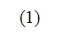{width="0.6041666666666666in"
height="0.3854166666666667in"}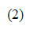{width="0.4375in"
height="0.3958333333333333in"}The linear model of a simple DC motor
consists of an electrical equation and a mechanical equation. Applying
Kirchhoff's Voltage Law (KVL) and Newton's second law, equation (1) and
(2) is obtained

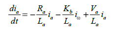{width="2.3958333333333335in" height="0.6875in"}

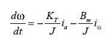{width="1.8645833333333333in"
height="0.6979166666666666in"}

> 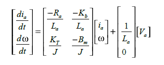{width="3.4895833333333335in"
> height="1.3958333333333333in"}The Steady state representation of the
> DC motor from the above equation is

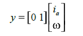{width="1.4479166666666667in"
height="0.6354166666666666in"}

> By using the formula of transfer function to state space model, the DC
> Motor transfer function is been obtained as.
>
> {width="2.3333333333333335in"
> height="0.40625in"}
>
> 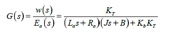{width="3.6770833333333335in"
> height="0.6875in"}
>
> **Linear Quadratic Regulator (LQR): -**
>
> It is a technique employed in modern control theory, particularly in
> the analysis of systems using the state-space approach. This method is
> favoured for its simplicity, making it suitable for multi-input
> multi-output systems. The broad applicability of the LQR design
> technique is evident in various fields.
>
> In the context of a DC motor control system, the speed of the motor
> can undergo changes due to variations in load and external
> disturbances. The primary objective of the LQR is to minimize
> deviations in the motor speed. The system\'s output, the motor speed,
> is compared with the applied input, which is the motor voltage. The
> LQR is responsible for reducing deviations in the motor speed, thus
> optimizing the system\'s performance.
>
> 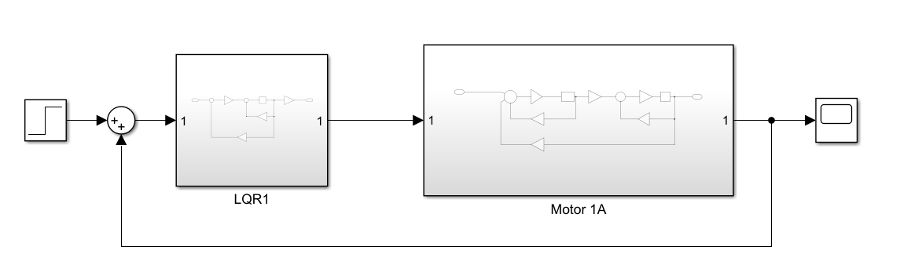{width="7.268055555555556in"
> height="2.0881944444444445in"}The general Block diagram of equation
> for this system is been built on the MATLAB Simulink and it is
> expressed as follows:

B)  **[Analysis: -]{.underline}**

> The State equation of the system is written as X\* = AX +Bu here A
> represents the state matrix of order n\*n and B represents the control
> matrix of order n, m where the n and m represents the number of state
> variable and the input variable.
>
> The linear quadratic regulator controller is designed such that the
> performance index is reduced to a minimized value. This is meant for
> achieving the desired performance of the system. The performance index
> (J) for a linear quadratic regulator controller is designed as

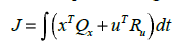{width="1.9375in" height="0.4791666666666667in"}

> The iterative process involves trial and error, considering system
> issues for Q and R matrix selection. While straightforward for LQR
> applications, this method can be time-consuming, depending on optimal
> Q and R values. Matrix elements correspond to system variables state
> for Q and input for R. The closed loop optimal control law is defined
> as **u\*= -Kx.** the proper placement of closed loop poles for the
> minimization. The feedback gain matrix K is dependent on A, B, Q and R
> matrices. The feedback gain matrix k is obtained by solving the
> Algebraic Riccati Equation (ARE), P defines a symmetric and positive
> definite matrix which is obtained by solution of the ARE is defined
> as.
>
> 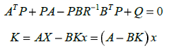{width="2.59411198600175in"
> height="0.729268372703412in"}
>
> 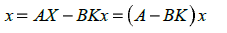{width="2.3649136045494314in"
> height="0.34379811898512685in"}

C)  **[Design: -]{.underline}**

> 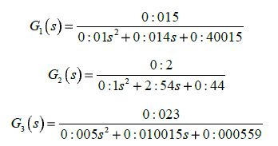{width="3.6255063429571304in"
> height="1.906515748031496in"}The transfer function of the three motors
> is given by the following equations.

I.  **Test Case Motor -- 1 : -**

> The transfer function of the DC Motor 1 is used to find out the
> response of the system while applying the step function as an input.
> The tuning of different points such as the LQR parameter Q and R is
> done with various values. The matrices A, B, C and D obtained from the
> specification of DC motor are **A = \[-4 -0.02; 0.5 -10\] B = \[4; 0\]
> C = \[0 1\] D = \[0\]** respectively. The Q and R values**, R =
> 0.000000009 Q = \[0.000000009; 15\]** are used in motor 1, giving a
> dynamic response.

II. **Test Case Motor -- 2 : -**

> The transfer function of the DC Motor 2 is used to find out the
> response of the system while applying the step function as an input.
> The tuning of different points such as the LQR parameter Q and R is
> done with various values. The matrices A, B, C and D obtained from the
> specification of DC motor are **A = \[-4 -0.4; 0.1666 -0.1666\] B =
> \[4; 0\] C = \[0 1\] D = \[0\]** respectively. The Q and R values**, R
> = 0.000000009 Q = \[0.000000009; 15\]** are used in motor 2, giving a
> dynamic response.

III. **Test Case Motor 3 : -**

> 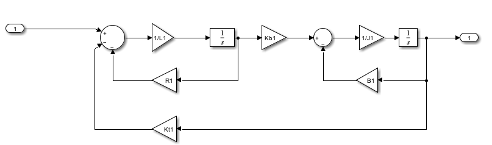{width="7.268055555555556in"
> height="2.1430555555555557in"}The transfer function of the DC Motor 3
> is used to find out the response of the system while applying the step
> function as an input. The tuning of different points such as the LQR
> parameter Q and R is done with various values. The matrices A, B, C
> and D obtained from the specification of DC motor are **A = \[-2
> -0.046 ;2.3 -0.003\] B = \[2 ; 0\] C = \[ 0 1 \] D = \[ 0 \]**
> respectively. The Q and R values**, R = 0.000000009 Q = \[0.000000009;
> 15\]** are used in motor 2, giving a dynamic response.

  ------------------------------------------------------------------------
  **DC Motor Parameters**        **Motor 1**    **Motor 2** **Motor 3**
  ------------------------------ -------------- ----------- --------------
  Armature Resistance Ra (Ohm)   2              2           1

  Armature Inductance La (H)     0.5            0.5         0.5

  Moment of inertia J (Kgm2)     0.02           1.2         0.01

  Friction constant B (Nms)      0.2            0.2         0.00003

  Torque constant KT (Nm/A)      0.015          0.2         0.023

  EMF constant Kb (Vs/rad)       0.01           0.2         0.023
  ------------------------------------------------------------------------

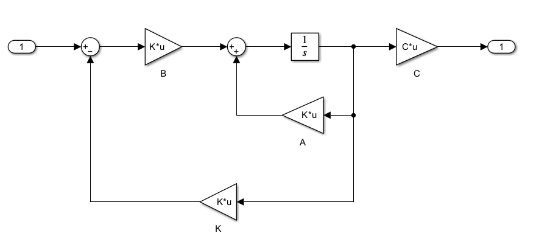{width="6.90625in"
height="2.8555555555555556in"}**[SIMULATION: -]{.underline}**

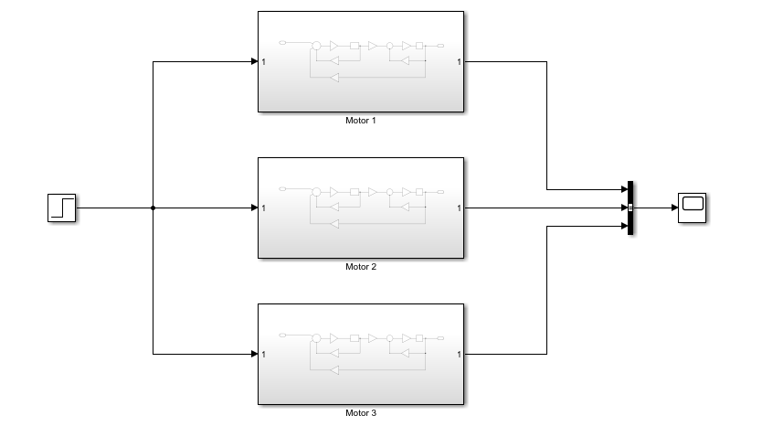{width="6.947916666666667in" height="3.88125in"}

**[RESULT: -]{.underline}**

Create the state space model and plot the step response through MATLAB
code and simulation execution.

-   **Motor 1: -**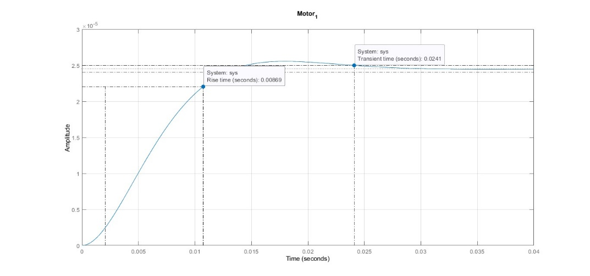{width="4.106944444444444in"
    height="2.2916666666666665in"}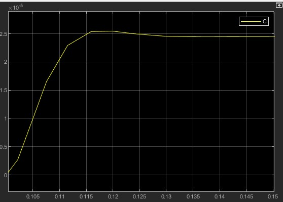{width="3.0375in"
    height="2.3541666666666665in"}

-   **Motor 2: -**

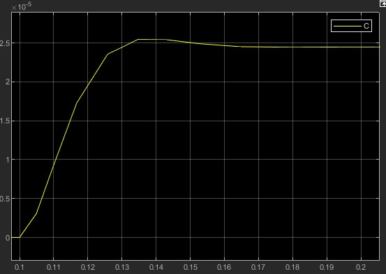{width="3.09375in"
height="2.40625in"}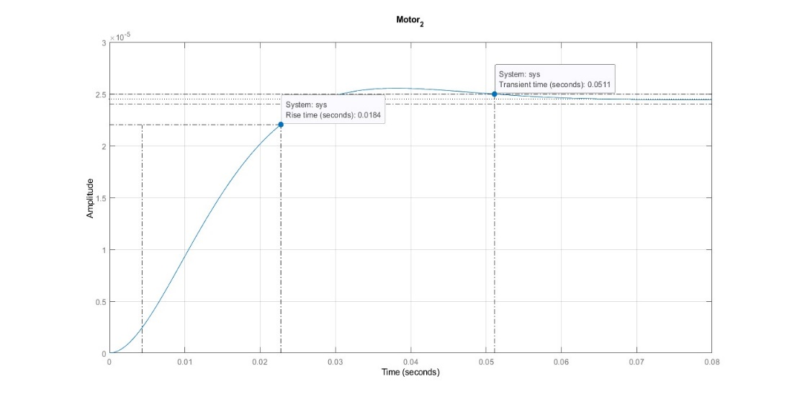{width="4.166666666666667in"
height="2.5in"}

-   {width="4.086111111111111in"
    height="2.6145833333333335in"}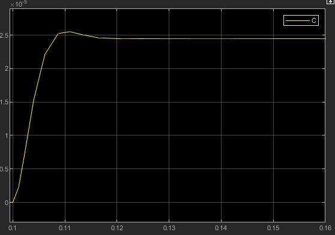{width="3.25in"
    height="2.4784722222222224in"}**Motor 3: -**

-   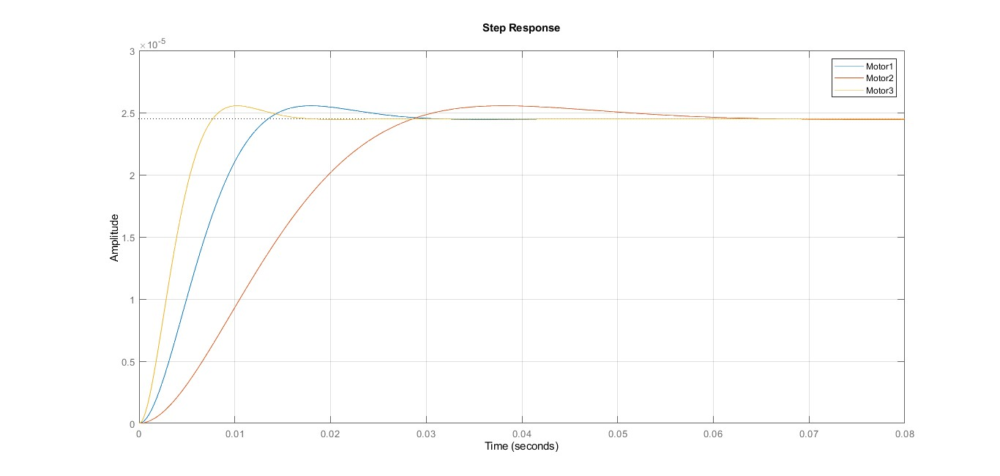{width="6.739583333333333in"
    height="3.0625in"}**Combine Response: -**

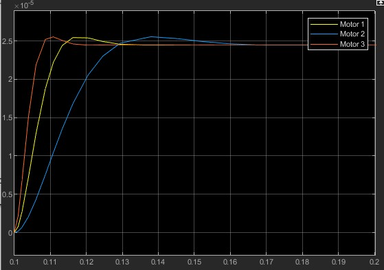{width="6.145833333333333in"
height="2.8881944444444443in"}

  -------------------------------------------------------------------------
  **System information**    **Motor 1**     **Motor 2**     **Motor 3**
  ------------------------- --------------- --------------- ---------------
  RiseTime                  0.0087          0.0184          0.005

  TransientTime             0.0241          0.0511          0.0138

  SettlingTime              0.0241          0.0511          0.0138

  SettlingMin               2.21E-05        2.21E-05        2.21E-05

  SettlingMax               2.56E-05        2.56E-05        2.56E-05

  Overshoot                 4.3074          4.3108          4.3207

  Peak                      2.56E-05        2.56E-05        2.56E-05

  PeakTime                  0.0179          0.0379          0.0102
  -------------------------------------------------------------------------

**[INTERPRETATION: -]{.underline}**

This paper explores the transient response of DC motors with varying
power ratings by employing an LQR optimal controller. The study,
conducted through simulations in MATLAB, specifically focuses on three
motors. The results indicate that the LQR controller enhances the
dynamic performance of lower-power DC motors, particularly motor 3,
showing improvements in both rise time and settling time.

The implications of these findings suggest that the LQR controller could
effectively mitigate the impact of jitter and transportation delay in
closed-loop responses, benefiting applications like cruise control and
process control. Additionally, the paper suggests that further research
into the selection of parameters Q and R in the LQR method could provide
valuable insights into optimizing generic systems.

**[REFERANCE: -]{.underline}**

Saisudha, V. & Seeja, G. & Pillay, R.V. & Manikutty, Gayathri & Rao,
Bhavani. (2016). Analysis of speed control of DC motor using LQR method.
9. 7377-7385.
